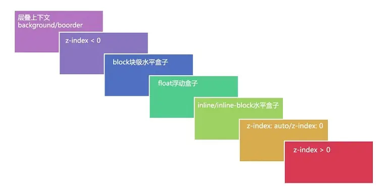

# z-index 的深入理解

**误区**： 以往包括一些很浅的教学总是认为`z-index`代表 z 轴的堆叠顺序优先级，也就是数值越大离屏幕观察者也就更近。

后来发现这是错误的。

首先，z-index 属性值并不是在任何元素上都有效果。它仅在**定位元素**（定义了 position 属性，且属性值为非 static 值的元素）上才有效果。
并且判断元素在 Z 轴上的堆叠顺序，不仅仅是直接比较两个元素的 z-index 值的大小，这个堆叠顺序实际由元素的层叠上下文、层叠等级共同决定。

#### 层叠上下文

每个盒模型的位置由平面画布上的 X 轴，Y 轴以及表示层叠的 Z 轴决定。一般情况下，元素在页面上沿 X 轴 Y 轴平铺，我们察觉不到它们在 Z 轴上的层叠关系。而一旦元素发生堆叠，这时就能发现某个元素可能覆盖了另一个元素或者被另一个元素覆盖。而一个元素如果存在层叠上下文，那他就会离屏幕观察者更近

普通元素的层叠等级优先由其所在的层叠上下文决定。

层叠等级的比较只有在当前层叠上下文元素中才有意义。这是因为`z-index`默认值是`auto`而不是`0`,祖先层叠上下文优先级更高

##### 如何产生层叠上下文

- HTML 中的根元素`HTML`本身就具有层叠上下文，称为“根层叠上下文”。本身就具有层叠上下文，称为“根层叠上下文”。
- 普通元素设置 position 属性为非 `static` 值并且`z-index`不是默认值`auto`，产生层叠上下文。
- CSS3 中的新属性也可以产生层叠上下文。

##### 层叠顺序

同一上下文的元素层叠顺序按照图示排布

### 总结

1. 首先先看要比较的两个元素是否处于同一个层叠上下文中：

   1. 如果两个元素处于同一个层叠上下文中，请比较他们的层叠等级。
   2. 如果是，谁的层叠等级大，谁在上面（怎么判断层叠等级大小呢？——看“层叠顺序”图）。

      如果两个元素不在统一层叠上下文中，请先比较他们所处的层叠上下文的层叠等级。

2. 当两个元素层叠等级相同、层叠顺序相同时，在 DOM 结构中后面的元素层叠等级在前面元素之上。
