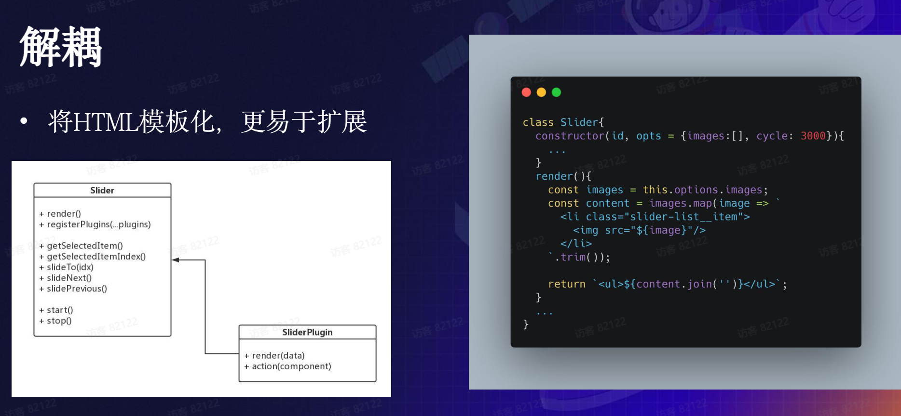

# 集训营 JavaScript 课程笔记

视频中分了四个板块，分别是 编码原则,

## 编码原则之各司其职

月影老师开篇探讨从工程师的角度上什么是好的 JavaScript 代码
提出三大原则: HTML,CSS,Js 各司其职,组件封装和过程抽象

`HTML，CSS，JS 各司其职`

背景问题:如何完成点击按钮白天黑夜模式的样式切换

- 版本一

```JavaScript
const btn = document.getElementById("modeBtn");
btn.addEventListener("click", (e) => {
const body = document.body;
if (e.target.innerHTML === "🌞") {
  body.style.backgroundColor = "black";
  body.style.color = "white";
  e.target.innerHTML = "🌜";
} else {
  body.style.backgroundColor = "white";
  body.style.color = "black";
  e.target.innerHTML = "🌞";
}
});
```

版本一直接用 JS 去修改了样式，而这更应该是 CSS 的职责，于是可以进一步优化为下边的代码

- 版本二

```JavaScript
const btn = document.getElementById("modeBtn");
btn.addEventListener("click", (e) => {
const body = document.body;
if (body.className !== 'night') {
  body.className = 'night'; ;
} else {
  body.className = '';
}
});
```

版本一和版本二的对比,后者用 night 类进行切换的样式修改，可读性和语义效果更好。后续改变样式也只需改变 CSS 代码

但是当我们思考代码中 行为逻辑时，发现只有点击改变样式。而控制样式是 CSS 的职责，于是可以进一步优化

- 版本三
  添加 checked 伪类选择器，选中之后改变样式
  纯展示类交互应寻求零 JS 方案

### 组件封装

> 组件是指 Web 页面上一个包含模版，功能和样式的单元。好的组件应具备封装性，功能性，扩展性和复用性

这里老师以轮播图为例示例如何做好组件
首先用三件套写好了一个"静态"(不能注入)的轮播图组件

- 优化点一：**插件化**
  将可选(除轮播核心功能外)元素抽取成插件，如使控制轮播图前进后退按钮的样式可变。插件和组件之间使用依赖注入的方式建立联系

  将原有的构造函数中的前进后退解耦一个单独的函数,降低耦合度,便于开发维护

- 优化点二： **模板化**,数据驱动
  将 HTML,轮播图的内容模板化而不是写死，更易于扩展,变得更加灵活(现代前端框架如 Vue、React 等都是数据驱动的框架，逻辑和结构融合能更高效地实现数据响应式的更新和渲染)

  将数据在 JS 中作为参数传入类的构造函数,调用 rende 方法生成 DOM
  这里也可以将 CSS 模板化

- 优化点三: **抽象**,组件框架
  可以给组件绑定注册多个插件，将插件和核心功能其抽象在一个内容中
  

### 过程抽象，应用函数式编程

案例:ToDoList

```JavaScript
const list = document.querySelector('ul');
const buttons = list.querySelectorAll('button');

buttons.forEach((button) => {
  button.addEventListener('click', (evt) => {
    const target = evt.target;
    target.parentNode.className = 'completed';
    setTimeout(() => {
      list.removeChild(target.parentNode);
    }, 2000);
  });
});
```

上边的代码有个 bug,如果两秒内多次点击,会访问被删除的节点
对于这样的情况，我们可以想应该做一个高阶函数使请求无论多少次只会响应第一次
